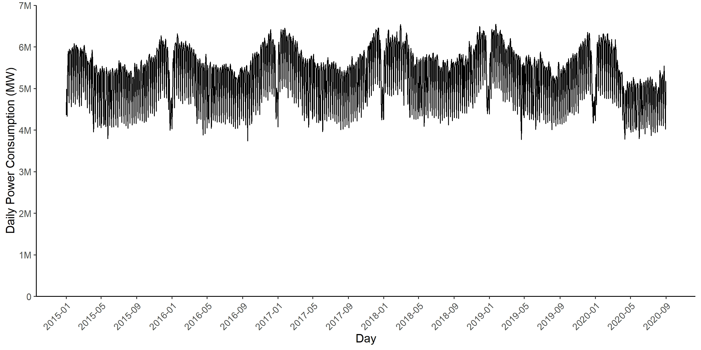
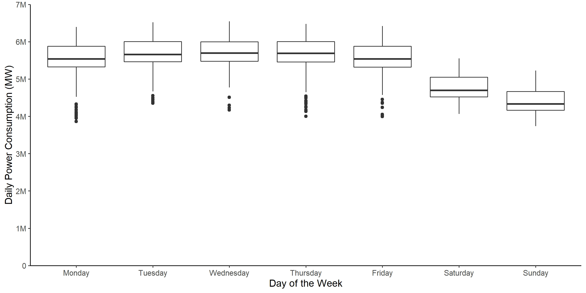
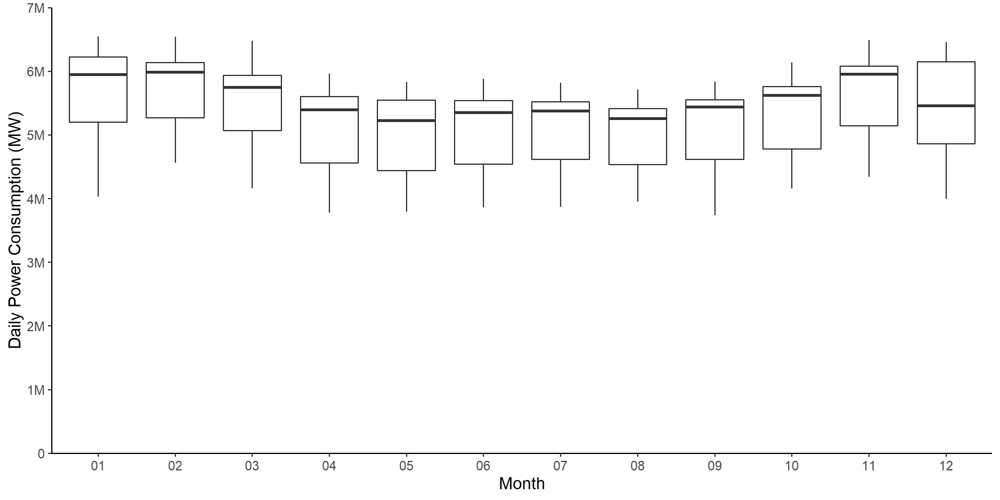
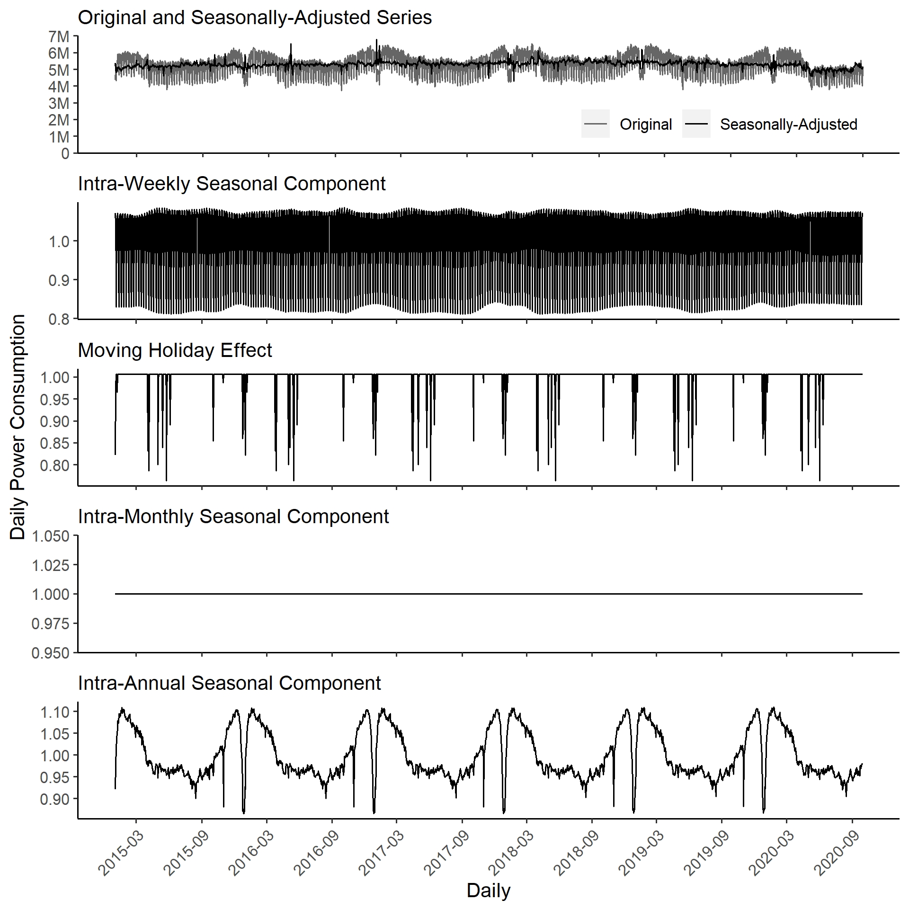

*This article was first published on [Medium](https://towardsdatascience.com/seasonal-adjustment-of-daily-time-series-1bd2aa9b096d).*

With the advent of Big Data, there has been quite a push concerning time series that are available on a daily basis.

Unfortunately, daily data tends to be noisy. For example, the time series could spike on weekends and at the beginning and end of each month. Add monthly deviations, and it becomes pretty hard to understand what’s going on.

Long story short, the seasonal components of these time series must be eliminated. But let’s talk about the basics first.

## Seasonal Adjustment Basics

Generally, time series consist of the following components: a trend-cycle, a seasonal, and an irregular fluctuation component (Chatfield, 2000; Hyndman & Athanasopoulos, 2021). This condition can be expressed as

Yₜ =TCₜ + Sₜ + Iₜ

where

Yₜ: original time series at time t

TCₜ: long-term or secular trend with a cycle that superimposes the trend component

Sₜ: seasonal component defined as a periodic infra-annual movement

Iₜ: irregular fluctuation component that describes the time series’ unexplained part.

Additionally, some authors extend the equation with, for example, moving holiday effects HEₜ or working day effects WDₜ (Darné et al., 2018).

Yₜ =TCₜ + Sₜ + HEₜ + WDₜ + Iₜ

The problem with raw time series is that it is hard to identify from which component the change is derived. Has the volume dropped due to a public holiday? Or is it an intra-annual effect that is repeated every year? For instance, a monthly time series could be higher in winter, while the summer months could be lower than a regular month.

If we are interested in short- or long-term movements of the time series, we do not care about the various seasonalities. We want to know the current status of the time series and if it has reached a turning point. Getting an understanding of this information has real business implications. Similarly, spurious relationships between economic variables are eliminated by focusing on only the trend-cycle and the irregular component. Furthermore, forecasting the different components and deriving a final result is a cheap and straightforward approach in obtaining forecasts (Granger, 1978).

Hence, there are many occurrences when we are solely interested in the trend-cycle and the irregular components. In order to gather these two components, the time series must be seasonally- and calendar adjusted (eurostat, 2015).

Straightforward deseasonalization approaches for monthly and quarterly time series have been available for a long time. Statistical agencies use it regularly for many official economic and social time series.

>But what about daily data?

There is currently no officially recognized deseasonalizing method for daily data. Still, using daily time series for deseasonalization could lead to better results than monthly or quarterly data since it entails more observations (eurostat, 2015).

## Daily Seasonal Adjustment

One promising alternative for seasonally and calendar adjusting daily time series is the daily seasonal adjustment (DSA) procedure from Ollech (2021).

This procedure combines the seasonal trend decomposition procedure using Loess (STL) developed by Cleveland et al. (1990) with a regression model with ARIMA errors (RegARIMA model). Seasonal patterns and calendar effects are estimated sequentially. The time series is adjusted in the following order:

1) STL adjusts intra-weekly periodic patterns.
2) RegARIMA estimates calendar effects, cross-seasonal effects, and outliers.
3) STL adjusts intra-monthly periodic effects.
4) STL adjusts intra-annual effects.

Ultimately, the DSA model is described as

Yₜ = TCₜ + Sₜ^7 + Sₜ^31 + Sₜ^365 + HEₜ + Iₜ

where intra-weekly, intra-monthly, and intra-annual periodic patterns at the day t are denoted as Sₜ^7, Sₜ^31, and Sₜ^365, respectively. The original time series and the other components are kept from the classical component model.

>But let’s try this methodology on a daily time series to understand how a typical procedure could look.

The [Western Europe Power Consumption](https://www.kaggle.com/francoisraucent/western-europe-power-consumption/version/1?select=de.csv) data set includes Germany’s daily power consumption (MW) over five years. Once we plot it, it becomes apparent that several seasonalities are present in the time series.

<figure>
  
  <figcaption> Daily Power Consumption (MW) Over Five Years in Germany. Image by Author.
</figcaption>
</figure>

For instance, it becomes clear that the median, the lower quartile, and the upper quartile for Saturdays and Sundays are below the remaining weekdays when inspecting daily power consumption. Still, some outliers are present during the week, which could indicate lower power consumption due to moving holidays.

<figure>
  
  <figcaption> Daily Power Consumption (MW) by Day of the Week Over Five Years in Germany. Image by Author.
</figcaption>
</figure>

Furthermore, the median, the lower quartile, and the upper quartile of power consumption are lower during the spring and summer than autumn and winter.

<figure>
  
  <figcaption> Daily Power Consumption (MW) by Month Over Five Years in Germany. Image by Author.
</figcaption>
</figure>

>Let’s start to deseasonalize the time series with the DSA approach.

First, I decide to use the logarithm of the power consumption to stabilize the variance of the series. Then, I set the number of observations in the local regression of the STL at 13 (relatively low!) for the intra-weekly periodic pattern to account for changes in the economic environment.

Third, many moving holidays are used in the RegARIMA model to control for their effects. Instead of using all moving holidays, I implement only those that show a significant effect below or around the ten percent level and drop the other moving holidays.

Based on the effects reported above, moving holidays consistently lower power consumption in the DSA procedure. For instance, Easter Monday and Pentecost Monday have the highest negative impact on power consumption.

Then I use the robust version of STL for the intra-annual effects (also with 13 observations to take care of economic changes). Still, I do not use STL for the intra-monthly periodic due to inconspicuous power consumption volumes throughout the months.

The below figure separately depicts the power consumption time series and its components (log-transformed). The time series has unique intra-weekly and intra-annual patterns, which are pretty stable over time. There are no patterns for the intra-monthly component since this effect was turned off. The seasonally-adjusted time series is the main result of the DSA approach.

<figure>
  
  <figcaption> Daily Power Consumption Components. Image by Author.
</figcaption>
</figure>

Similar to Ollech (2021), I benchmark the seasonally-adjusted time series by comparing it to results of other deseasonalization approaches, namely the seasonal-trend decomposition procedure based on regression (STR) introduced by Dokumentov and Hyndman (2021) and TBATS derived by de Livera et al. (2011).

I use two tests that can detect residual seasonality — the QS test and the Friedman test. The time series that show no sign of residual seasonality intra-yearly, intra-monthly, and intra-weekly have been successfully deseasonalized (Ollech, 2021). Hence, the results from this analysis should indicate which procedure leads to the best results.

The QS test’s null hypothesis is no positive autocorrelation in seasonal lags in the time series. Similarly, the Friedman test’s null hypothesis is no significant differences between the values’ period-specific means present in the time series.

The above table shows the QS and Friedman tests’ results. TBATS leads to similar results compared to the original time series. STR does not reject the null hypotheses for the intra-monthly seasonality, but now the QS and Friedman test’s hypotheses are rejected for the intra-yearly seasonality. Only the DSA approach leads to results where the hypotheses for all seasonalities are not rejected. Hence, I assume that the DSA approach is superior to the STR and TBATS procedures.

## Conclusion

Ultimately, the DSA approach from the German Central Bank is a great deseasonalization tool which takes several seasonality frequencies and holiday effects into account. The obtained results can be used to locate the time series’ current status and identify turning points.

The method itself has been, for instance, used for the deseasonalization of the daily truck toll mileage index of the German Federal Statistical Office (Cox et al., 2020), and I am excited to see where else it will be used in the future. Although it is not yet the go-to deseasonalization approach for daily data, its unique approach using STL and RegARIMA holds great potential.

## Want more information?

This article’s main goal was to give an introduction to the DSA procedure and make it somewhat more known.

If you’re interested in my code, please check out the [repository on Github](https://github.com/JRatschat/DSA).

If you want to apply this procedure in one of your own projects, I would like to point you to the [DSA library’s vignette](https://cran.microsoft.com/snapshot/2021-09-26/web/packages/dsa/vignettes/dsa-vignette.html) from which I got great guidance (and code snippets). Also, the published papers from Daniel Ollech provide a detailed theoretical description of the approach.

*If you have any questions or comments, feel free to reach me via the contact field or [LinkedIn](https://linkedin.com/in/jonathan-ratschat).*

*Stay tuned, and see you in the next post!*

## References

Chatfield, C. (2000).Time-series forecasting. Chapman & Hall.

Cleveland, R. B., Cleveland, W. S., McRae, J. E., & Terpenning, I. (1990). STL: A seasonal-trend decomposition procedure based on loess. Journal of Official Statistics, 6(1), 3–73.

Cox, M., Triebel, J., Linz, S., Fries, C., Flores, L. F., Lorenz, A., Ollech, D.,Dietrich, A., LeCrone, J., & Webel, K. (2020). Täglicher Lkw-Maut-Fahrleistungsindex aus digitalen Prozessdaten der Lkw-Maut-Erhebung. WISTA — Wirtschaft und Statistik, 4, 63–76.

de Livera, A. M., Hyndman, R. J., & Snyder, R. D. (2011). Forecasting time series with complex seasonal patterns using exponential smoothing. Journal of the American Statistical Association, 106(496), 1513–1527. https://doi.org/10.1198/jasa.2011.tm09771

Darné, O., Ferrara, L., & Ladiray, D. (2018). A brief history of seasonal adjustment methods and software tools. In G. L. Mazzi, D. Ladiray, & D. A. Rieser (Eds.), Handbook on seasonal adjustment (pp. 69–90). Publications Office of the European Union.

Dokumentov, A., & Hyndman, R. J. (2021). STR: A seasonal-trend decomposition procedure based on regression (April 4, 2021).

eurostat. (2015). ESS guidelines on seasonal adjustment. https://doi.org/10.2785/317290

Granger, C. W. J. (1978). Seasonality: Causation, interpretation, and implications. In Arnold Zellner (Ed.), Seasonal analysis of economic time series (pp. 33–56). NBER.

Hyndman, R. J., & Athanasopoulos, G. (2021). Forecasting: Principles and practice (3rd ed.). OTexts. https://otexts.com/fpp3

Ollech, D. (2021). Seasonal adjustment of daily time series. Journal of Time Series Econometrics, aop, 1–30. https://doi.org/10.1515/jtse-2020-0028

Ollech, D., & Webel, K. (2020). A random forest-based approach to identifying the most informative seasonality tests. Deutsche Bundesbank Discussion Paper No55/2020.

U.S. Census Bureau. (2017). X-13ARIMA-SEATS reference manual: Accessible HTML output version (Version 1.1). http://www.census.gov/srd/www/x13as/