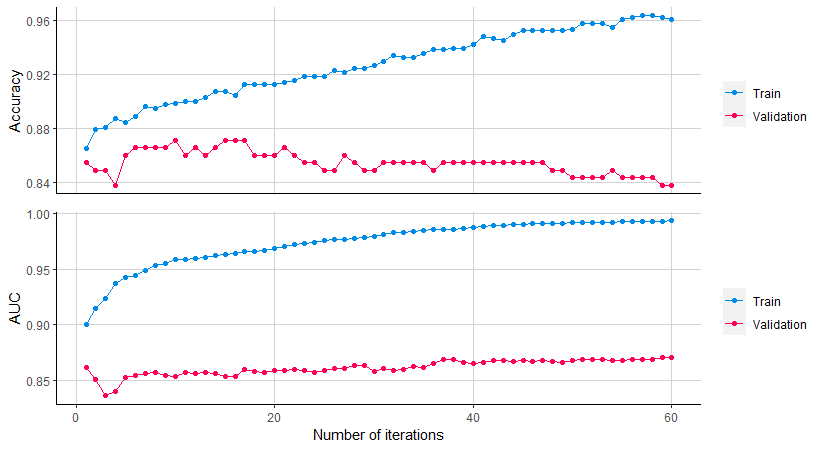
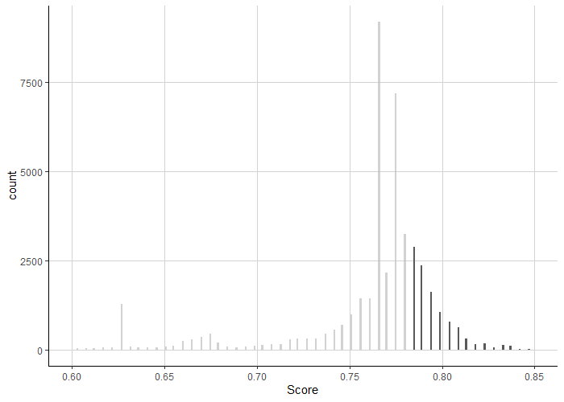

*This article was first published on [Medium](https://towardsdatascience.com/getting-to-an-hyperparameter-tuned-xgboost-model-in-no-time-a9560f8eb54b).*

Let's face it. You're an aspiring Data Scientist. You need to desperately solve a classification task either to impress your professor or to finally become one of these mysterious Kaggle winners. The problem is that you've got no time. The presentation or the Kaggle competition is due in 24 hours. Of course, you could stick to a simple logit regression and call it a day. "No, not this time!" you think, and you're browsing the web to find THE SOLUTION. But it better be fast.

Okay, this is a highly improbable event. However, I wanted to share an easy XGBoost implementation that proved to be lightning-fast (compared to other solutions) that can help you to achieve a more stable and accurate model.

Hyperparameter-tuning was the step in which I lost most of my "valuable" time. I had to choose between different options ranging from manually trying out different hyperparameter combinations to more advanced methods like grid or random search. I felt overwhelmed. Ultimately, it took quite a while to find a technique that fulfilled my needs. Therefore, the focus will be on this step of building an XGBoost model.

Why are we using XGBoost again? Because it rocks. It is an optimized distributed gradient boosting library that has been used with great success on many machine learning challenges. Among the advantages of XGBoost are that its models are easily scalable, tend to avoid overfitting, and can be used for a wide range of problems [1].

Of course, only preparing the data and executing XGBoost would somehow work. But clearly, there is no free lunch in data science. This procedure would leave you with a model that is most likely overfitted and therefore performs badly on an out-of-sample data set. Meaning: you have created a useless model that you should not use with other data.

Luckily, XGBoost offers several ways to make sure that the performance of the model is optimized. Hyperparameter-tuning is the last part of the model building and can increase your model's performance. Tuning is a systematic and automated process of varying parameters to find the "best" model.

In my opinion, learning is best done through a reproducible example, so please feel free to copy the code and run it in RStudio (or any other IDE) if you are experiencing any troubles with my explanations. I assume a basic understanding of machine learning, so please use Google if anything is not clear.

In the first part, I build (together with you) a basic XGBoost model. Thus, we are loading, preparing, and transforming the data, and at the end of this section, we will have received our first results. In the second part, I discuss my experiences with several hyperparameter-tuning methods. For our final model, we will use a random search algorithm to increase the predictive accuracy of our binary classification task.

Let's get started.

## Building an XGBoost model with (mostly) default parameters

I chose to use the famous Titanic data set from Kaggle. If you have a Kaggle account, you can get the data here. If you don't have a Kaggle account, you can also check out my GitHub repository, where you'll find the data sets and the scripts of this blog post. As an aspiring data scientist, you most likely have at least one of these accounts.

Our task is to predict whether a passenger survived the tragic titanic incident or not - a typical binary classification task.

First, we load the necessary packages and train.csv and test.csv. Then we can have a look at the structure of the data.

<script src="https://gist.github.com/JRatschat/b620655cb2b53da232289360dad8beab.js"></script>

```> str(train)
'data.frame': 891 obs. of  12 variables:
  $ PassengerId: int  1 2 3 4 5 6 7 8 9 10 ...
$ Survived   : int  0 1 1 1 0 0 0 0 1 1 ...
$ Pclass     : int  3 1 3 1 3 3 1 3 3 2 ...
$ Name       : chr  "Braund, Mr. Owen Harris" "Cumings, Mrs. John Bradley (Florence Briggs Thayer)" "Heikkinen, Miss. Laina" "Futrelle, Mrs. Jacques Heath (Lily May Peel)" ...
$ Sex        : chr  "male" "female" "female" "female" ...
$ Age        : num  22 38 26 35 35 NA 54 2 27 14 ...
$ SibSp      : int  1 1 0 1 0 0 0 3 0 1 ...
$ Parch      : int  0 0 0 0 0 0 0 1 2 0 ...
$ Ticket     : chr  "A/5 21171" "PC 17599" "STON/O2. 3101282" "113803" ...
$ Fare       : num  7.25 71.28 7.92 53.1 8.05 ...
$ Cabin      : chr  "" "C85" "" "C123" ...
$ Embarked   : chr  "S" "C" "S" "S" ...

> str(test)
'data.frame': 418 obs. of  11 variables:
  $ PassengerId: int  892 893 894 895 896 897 898 899 900 901 ...
$ Pclass     : int  3 3 2 3 3 3 3 2 3 3 ...
$ Name       : chr  "Kelly, Mr. James" "Wilkes, Mrs. James (Ellen Needs)" "Myles, Mr. Thomas Francis" "Wirz, Mr. Albert" ...
$ Sex        : chr  "male" "female" "male" "male" ...
$ Age        : num  34.5 47 62 27 22 14 30 26 18 21 ...
$ SibSp      : int  0 1 0 0 1 0 0 1 0 2 ...
$ Parch      : int  0 0 0 0 1 0 0 1 0 0 ...
$ Ticket     : chr  "330911" "363272" "240276" "315154" ...
$ Fare       : num  7.83 7 9.69 8.66 12.29 ...
$ Cabin      : chr  "" "" "" "" ...
$ Embarked   : chr  "Q" "S" "Q" "S" ...
```

After getting an overview, we need to perform data preparation and feature engineering tasks. I just used some common sense and looked for some examples on Kaggle. Feature engineering is not the focus of this post. Therefore, I stick to the basics. But be aware that feature engineering is generally a crucial step and can significantly enhance the performance of your model. If you are not writing a blog post about hyperparameter-tuning, then spend much more time on this step! If you need individual guidance with excellent explanations, have a look here.

To perform these tasks, we bind the rows of the train and test set into one data frame. XGBoost needs to be able to work with the data. Therefore, we need to one-hot encode the data sets into sparse matrices. This is done because XGBoost only works with numeric or integer variables. Since we have factor variables in our data sets, the following approach creates one column per feature level. So instead of one row for Pclass, we will obtain the rows Pclass1, Pclass2, and Pclass3. This is also the reason why I put train and test set into one data set. Previously, when performing these tasks independently, the structure of the data got messed up.

<script src="https://gist.github.com/JRatschat/eafe53798b153c617c59c16e4a4ab334.js"></script>

After conducting the data preparation and the feature engineering tasks, we split train and test set again.

After these steps, the structure of the train and test data set is the same. Only the Survived variable is not present in the test set.

```> str(train)
'data.frame': 891 obs. of  13 variables:
  $ Pclass1  : num  0 1 0 1 0 0 1 0 0 0 ...
$ Pclass2  : num  0 0 0 0 0 0 0 0 0 1 ...
$ Pclass3  : num  1 0 1 0 1 1 0 1 1 0 ...
$ Sexmale  : num  1 0 0 0 1 1 1 1 0 0 ...
$ Age      : num  22 38 26 35 35 NA 54 2 27 14 ...
$ SibSp    : num  1 1 0 1 0 0 0 3 0 1 ...
$ Parch    : num  0 0 0 0 0 0 0 1 2 0 ...
$ Fare     : num  7.25 71.28 7.92 53.1 8.05 ...
$ EmbarkedC: num  0 1 0 0 0 0 0 0 0 1 ...
$ EmbarkedQ: num  0 0 0 0 0 1 0 0 0 0 ...
$ EmbarkedS: num  1 0 1 1 1 0 1 1 1 0 ...
$ Family   : num  1 1 0 1 0 0 0 4 2 1 ...
$ Survived : int  0 1 1 1 0 0 0 0 1 1 ...

> str(test)
'data.frame': 418 obs. of  12 variables:
  $ Pclass1  : num  0 0 0 0 0 0 0 0 0 0 ...
$ Pclass2  : num  0 0 1 0 0 0 0 1 0 0 ...
$ Pclass3  : num  1 1 0 1 1 1 1 0 1 1 ...
$ Sexmale  : num  1 0 1 1 0 1 0 1 0 1 ...
$ Age      : num  34.5 47 62 27 22 14 30 26 18 21 ...
$ SibSp    : num  0 1 0 0 1 0 0 1 0 2 ...
$ Parch    : num  0 0 0 0 1 0 0 1 0 0 ...
$ Fare     : num  7.83 7 9.69 8.66 12.29 ...
$ EmbarkedC: num  0 0 0 0 0 0 0 0 1 0 ...
$ EmbarkedQ: num  1 0 1 0 0 0 1 0 0 0 ...
$ EmbarkedS: num  0 1 0 1 1 1 0 1 0 1 ...
$ Family   : num  0 1 0 0 2 0 0 2 0 2 ...
```

Remember the overfitting problem that I talked about? To obtain a better model, this problem needs to be prevented while ensuring that the model learns the generalized underlying relationships of the features with the target variable. So we use the train set and split it into a training and a validation set. We use 80% of the passengers for training the model and 20% for the validation of the model. Keep on waiting. I will explain what the validation set does in a few paragraphs.

<script src="https://gist.github.com/JRatschat/653426424936cc3d03da607f714fa557.js"></script>

Afterward, we will create xgb.DMatrices. These are optimized matrices for XGBoost. The label attribute specifies the target variable. We cannot specify a label for the test set since we do not have any information about it.

<script src="https://gist.github.com/JRatschat/8162866c15fc4762f5929b17c60302c0.js"></script>

Finally, we can train our first XGBoost model. We use the xgboost.train() command, and the gradient booster tree and the objective of binary classification are specified. The maximum number of iterations is set to 1,000. After these settings, the boosting algorithm could be implemented without further specifications on the training set. When keeping the default values, the algorithm would create 1,000 iterations of the model.

What is the problem here? Imagine you are setting the number of iterations to a high number. Then the model iterates forever, and in the end, you would get an accuracy of 100% on your training data. When testing this model on the test set, something strange would happen. “Why do I have only [put any low number here]% accuracy?! I thought my model was perfect!”. True, perfect in the sense that it perfectly describes the underlying data of your training set. Generalizable on other data? No.

To prevent this behavior, we create the validation set that I have talked about. We use the training set to train a model. But instead of training it until eternity, we set the early_stopping_rounds parameter to 50. Setting this parameter is important because it will stop the training of the model when the accuracy of the validation set has not improved for the specified number of rounds. When this is the case, then the algorithm automatically chooses the iteration with the highest accuracy. This setting prevents our overfitting problem.

In the following figure, you can quickly see this behavior. I display accuracy (1-error) and AUC of an XGBoost model depending on the iteration for the training and the validation set. Following my explanations, the training set would quickly reach an accuracy of 96% after 60 rounds. Luckily, our algorithm detects that the validation accuracy is not improving after ten iterations and therefore stops the algorithm at this iteration. Interestingly, the AUC is improving until round 60, so when changing the evaluation metric, we would get another result. Therefore, a change in the evaluation metric can lead to different results. Since we want to optimize the accuracy of the model, we stick to accuracy as an evaluation metric.

<figure>
  
  <figcaption>Accuracy and AUC by Iteration of a XGBoost Model. Plot created by author.</figcaption>
</figure>

Okay, now it’s time to reveal the default XGBoost algorithm. Specifying the watchlist is an important step here because it is the parameter that tells XGBoost to stop iterating when the validation accuracy (1-error) does not improve anymore.

<script src="https://gist.github.com/JRatschat/bf54634575d40158059c039744abb904.js"></script>

```[1] train-auc:0.900544 train-error:0.134831 val-auc:0.861180 val-error:0.145251 
Multiple eval metrics are present. Will use val_error for early stopping.
Will train until val_error hasn't improved in 50 rounds.
[11] train-auc:0.959340 train-error:0.099719 val-auc:0.856732 val-error:0.139665 
[21] train-auc:0.970900 train-error:0.085674 val-auc:0.858648 val-error:0.134078 
[31] train-auc:0.981661 train-error:0.070225 val-auc:0.860495 val-error:0.145251 
[41] train-auc:0.988527 train-error:0.051966 val-auc:0.865969 val-error:0.145251 
[51] train-auc:0.992277 train-error:0.042135 val-auc:0.868979 val-error:0.156425 
Stopping. Best iteration:
[10] train-auc:0.959241 train-error:0.101124 val-auc:0.853243 val-error:0.128492
```

We then predict Survival of the validation set with our model. We display our results with the confusionMatrix command. Ahhhh important information: this is only the result of our validation set! Right now, we want to get a feeling of how good our model COULD be. Please do not confuse it with the test that we will perform afterward with the test set.

<script src="https://gist.github.com/JRatschat/95f936add95193619b24b03a21bf176c.js"></script>

```Actual Data
Prediction     Not Survived Survived
Not Survived          109       16
Survived                7       47
Accuracy : 0.8715          
95% CI : (0.8135, 0.9168)
No Information Rate : 0.648           
P-Value [Acc > NIR] : 1.189e-11
Kappa : 0.7088
Mcnemar's Test P-Value : 0.09529         
                                          
            Sensitivity : 0.7460          
            Specificity : 0.9397          
         Pos Pred Value : 0.8704          
         Neg Pred Value : 0.8720          
             Prevalence : 0.3520          
         Detection Rate : 0.2626          
   Detection Prevalence : 0.3017          
      Balanced Accuracy : 0.8428          
                                          
       'Positive' Class : Survived
```

What comes first to my mind is that our first model is especially great in predicting people that died (as seen by the specificity metric). To make a statement about how great our first attempt is, we must assess the balance (in our case imbalance) of the target variable. How many people have survived? How many people died? Quick calculations:

```There are 179 passengers in the validation set of whom 63 survived (1) and 116 died (0).
P(prediction=0) = P(class=0) = 0.648
P(prediction=1) = P(class=1) = 0.352
acc = P(class=0) * P(prediction=0) + P(class=1) * P(prediction=1)
    = (0.648 * 0.648) + (0.352 * 0.352)
    = 0.5438
```

So what we can say is that our model performed 32.77 percentage points (0.8715–0.5438) better than a “weighted guess” (thanks to this post for refreshing my knowledge). But as I said, this is only the result of the validation set which we used to optimize our model. So let’s test our default model by submitting it to Kaggle.

After uploading the predictions of the test set to Kaggle, we get our first result. We reached an accuracy of 76.07%. So we lost around 11% compared to the validation accuracy…DAMN.

>"But maybe there is light at the end of the tunnel?! What if hyperparameter-tuning is the solution?!"

## Hyperparameter-Tuning of an XGBoost Model

There are different approaches to select hyperparameters. Due to this high degree of choice, many users choose the values of hyperparameters based on reputation, intuitive appeal, or adhere to the default parameter values. This may result in a model whose potential has not been fully utilized [2]. Okay, what have we learned? A structured hyperparameter-tuning process can increase the potential of our model!

What I certainly did was to look at these great posts to get a feeling of how I could do it: here and here.

Some authors used an iterative manual search approach. They selected hyperparameter-values, ran the model, looked at the output, found some logic, and repeated the whole process. Some first optimized the learning rate, other the number of tree leaves, etc. For me, I could not find one clear routine and it is definitely a time-consuming process. Also, it does not seem to follow the definition of tuning since this process is not really systematic and automated.

Way more advanced, I found hyperparameter-tuning procedures in the mlr and caret packages that make use of grid and random search procedures. But what are grid and random search? The grid method runs all possible combinations of predefined values for hyperparameters. The higher the number of discrete values for hyperparameters and the more hyperparameters, the more computationally expensive this method. To be specific, grid search creates an exponentially increasing number of models the more values and the more hyperparameters are used. Thus, it gets difficult to handle quite quickly. With random search, one only defines the search space and sets the number of models that have to be created.

So I had a look into the literature and found a great paper from Bergstra et al. (2012). Their research shows that the random search approach has a higher efficiency compared to grid trials and manual search when granting the same computation time. Also, contradictory to the manual search of hyperparameters, the results acquired through random search are reproducible [3]. NICE!

Actually, I build a random search algorithm with the mlr package, but I faced severe problems. Due to the complex structure of this algorithm, the process had long running times and I could only test around 150 models per hour. Definitely too slow for an algorithm that takes less around 1 second to execute. Sure, k-fold cross-validation sounds really cool and provides more reliable results, but I just was not patient enough. Luckily, we have out-of-bag observations as provided in the test set through which we can evaluate the model performance of the trained algorithm. Also, testing my results became an issue. I could just not say with certainty that I created the algorithm with the right settings. This was due to the fact that I could not compare the results of the algorithm and a simple XGBoost model with the same hyperparameter-values because of k-fold cross-Validation.

So what did I do? In the end, I just created 10,000 random hyperparameter-value sets within a given search space with a for-loop. Then I executed the XGBoost algorithm 10,000 times with the predefined hyperparameter value sets. Of course, I saved the hyperparameter values and the corresponding validation accuracy as a csv-file. Specifying a seed before the random creation of the hyperparameters and the search algorithm ensured that the results are reproducible.

<script src="https://gist.github.com/JRatschat/9ae001ec6d13c2a0e736f617a7fc21d0.js"></script>

To evaluate my approach, I asked myself the following questions:

* Do I understand my procedure? Yes.

* Can I explain this approach to my professor or my fellow Kaggle competitors? Yes.
* How long did it take to compare 10,000 XGBoost models with differing hyperparameter values? 29.7 minutes with a standard consumer laptop. Is this fast? Yes. Could I increase the speed with parallel computing if I wanted? Yes.
* Can I state that I have found the best model? No. Although a high number of models are created, it is clear that the described approach has not found the very best model performance. To obtain better results, one could alter the search space or even include more hyperparameters. Still, finding the perfect model could not be stated after additional random searches with changed settings.
* Does that procedure lead to the most stable model there is? Most likely not. As I said, using other methods (k-fold cross-validation, stratification, etc.) could lead to a more stable model.

So in the end, I decided on a procedure that is both fast and easy.

Let’s have a look at the random search table.

<script src="https://gist.github.com/JRatschat/6553616b4edf0a6a950641b99afd1d95.js"></script>

<script src="https://gist.github.com/JRatschat/dc6037f17d3c22d15845f57b2b3436cc.js"></script>

Values are rounded. If only copied like this into the model, you will obtain different results.

Indeed, hyperparameter tuning has a strong effect on the performance of the model. The validation accuracy ranges between 80.4 percent and 89.4 percent, with a median of 86.6 percent and a mean of 86.7 percent. Remember, the validation accuracy that we got from an XGBoost model with default values was 87.2 percent…

To see more details, we plug the hyperparameters of the best hyperparameter value set into our XGBoost algorithm and again have a look at the model’s statistics and the confusion matrix.

<script src="https://gist.github.com/JRatschat/25126e95491332b31b71fc9aeb64862a.js"></script>

```Actual Data
Prediction     Not Survived Survived
Not Survived          110       13
Survived                6       50
Accuracy : 0.8939          
95% CI : (0.8392, 0.9349)
No Information Rate : 0.648           
P-Value [Acc > NIR] : 4.303e-14
Kappa : 0.7612
Mcnemar's Test P-Value : 0.1687          
                                          
            Sensitivity : 0.7937          
            Specificity : 0.9483          
         Pos Pred Value : 0.8929          
         Neg Pred Value : 0.8943          
             Prevalence : 0.3520          
         Detection Rate : 0.2793          
   Detection Prevalence : 0.3128          
      Balanced Accuracy : 0.8710          
                                          
       'Positive' Class : Survived
```

Most significant improvement: sensitivity has increased by 4.77 percentage points. Having better validation results is great, but in the end, only our test accuracy score is essential. Now, the final moment has come…

<script src="https://gist.github.com/JRatschat/9be2d602fcb4877e75cc9205a343c0c4.js"></script>

We get an accuracy of 77.99%. This is better than the accuracy of our base model. But how have we done against other Kaggler’s? Hmmm…it doesn’t look too good for our model, as we can see in the below plot. We are only under the top 37%. That’s why we come to the final learning of my blog post. Hyperparameter-tuning is the last part of the model creation process. Since I got too excited about my search algorithm, I did not put enough time in feature engineering my model. Without useful features that the model can learn from, I can do all the hyperparameter-tuning I want. It will still be just mediocre. Therefore, when time is limited, one should focus on feature engineering and not on hyperparameter-tuning.

<figure>
  
  <figcaption>Histogram of the public leaderboard scores. The models that have had better accuracy than our model are displayed in black, the others are displayed in grey. We would have gotten an accuracy of 0.627 if we had predicted that everyone died. An accuracy of 0.766 would have been achieved if we had predicted that all males over the age of three died and that the women and children survived. Plot created by author.</figcaption>
</figure>

Were all the efforts for nothing? Of course not. If you have enough time, you can create great features and use a hyperparameter-tuning process (in the end!) that helps you to extract the very last accuracy percentage points out of your model.

## Conclusion

What I have introduced here is a procedure that I used to tune the model that I created for a seminar paper. Although plenty of information can be found via Google, I struggled to find a suitable solution for my needs. What I wanted, in the end, was something that I could correctly understand and which did not require endless hours to compute. Also, I wanted an automated approach whose results I could replicate at any point in time. These criteria are definitely fulfilled by my simple random search algorithm.


I don’t claim that this procedure leads to the best or the most stable model. If you had the pleasure to stumble upon a better solution, have any questions or comments, feel free to reach me via the contact field or [LinkedIn](https://linkedin.com/in/jonathan-ratschat).

## References

[1] Chen, T. & Guestrin, C. (2016), Xgboost: A scalable tree boosting system, in B. Krishnapuram & M. Shah, eds, ‘KDD ’16: Proceedings of the 22nd ACM SIGKDD International Conference on Knowledge Discovery and Data Mining’, pp. 785–794.

[2] Thornton, C., Hutter, F., Hoos, H. H. & Leyton-Brown, K. (2013), Autoweka: Combined selection and hyperparameter optimization of classification algorithms, in R. Ghani, T. E. Senator, P. Bradley, R. Parekh & J. He, eds, ‘KDD ’13: Proceedings of the 19th ACM SIGKDD international conference on Knowledge discovery and data mining’, pp. 847–855.

[3] Bergstra, J. & Bengio, Y. (2012), ‘Random search for hyper-parameter optimization’, Journal of Machine Learning Research 12, 281–305.


