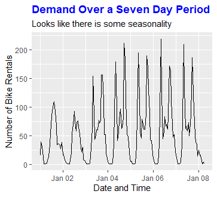

*This article was first published on [Medium](https://towardsdatascience.com/how-190-students-and-i-have-learned-data-science-55da9e0e5c6b).*

Two years ago, I was taking a beginner’s class in R at my university. I had heard of the term data science, but I didn’t even know that this would be my first exposure to this exciting world.

Honestly, I was just taking this class to meet people. The week quickly passed, I learned some of the basics and got interested in programming. But I didn’t know how I should proceed.

So I did some additional online classes on DataCamp but quickly stopped. Why? Even though the website itself is an excellent starting point, I just did not have goals that would keep me going.

>My life went on, I had other responsibilities, and coding was not a priority anymore.

Fast forward two years. I have conducted several data science projects ranging from prediction to text mining tasks in Python and R. More importantly, my team and I at [TechAcademy](https://tech-academy.io/) have supported 190 students in their journey to learn to code. Students with different backgrounds and experiences.

I want to share my perspective with you. It’s a personal assessment of what works best to get results fast. Keep in mind that everyone is different. So if you

* are just starting to learn to code,
* can’t stand to do another online class or get relatively fast bored with online assignments,
* or wonder which philosophy we used to teach 190 students coding,

then keep on reading.

So what changed? How could I go from zero to where I am now?

Ultimately, the only thing that counts is motivation. I had to make sure that coding became a priority. Up until then, my thoughts around coding were based on extrinsic motivation. This is what was going on in my head:

>Oh yeah, I heard that coding is essential in the 21st century. I will have much better opportunities in the job market if I know how to handle some lines of code.

I had to switch it to a more intrinsically motivated way of thinking.

>I really like coding. It’s fun to get exciting results with every line of code that I write. It enables me to do really crazy shit.

Who do you think has more stamina? The oh-I’m-having-better-job-opportunities-guy or the person that really just loves coding for the sake of coding?

But to get to this state, you have to put in the work. You can’t love coding when you have only watched a few tutorials. Coding is not a quick game of Rock Paper Scissors. Coding is more like a long game of Risk.

In the beginning, it’s hard to understand the rules. But once you’re in the flow, every new situation gets easier. This is the point that you want to reach. You want to understand the underlying rules of the programming language of your choice. Afterward, every new project or method is doable and exciting.

But how can you reach that state? And how can we make sure that you are going to love coding?

## Basics

Online classes have their place, especially for beginners. They are a perfect starting place for taking on the basics.

So if you’ve never written a line of code, head over to an online learning platform like [Datacamp](https://www.datacamp.com/?tap_a=5644-dce66f&tap_s=954303-e3524b&utm_medium=affiliate&utm_source=jonathanratschat) *(affiliate link)* or Udemy. There you can start to understand the programming language that you want to learn.

But how many online classes should you do? I recommend sticking to the basics. Try to keep it simple. Why? Because after some classes you should have quite a good idea of how this programming language works.

You could go on and learn everything there is through online classes. I doubt that this is the most efficient and effective way of learning data science.

Some classes teach you every way possible to load data into R or Python. dta-, csv-, excel-, json-, whatever-files… But do you really need to spend 6 hours of your valuable time to learn this? It’s way more efficient to just google how to load your specific file when you actually have a file that you want to use. This should be sufficient, right?

For me, getting an overload of information that I’m not going to use is pointless. It’s a waste of time. Also, I’m just not good at following online classes. I get bored very fast. And this kills my motivation. If you enjoy online courses, then you can, of course, take more classes. But please be intentional about them.

## Taking it to the next level

Now that you have learned the basics, how should you proceed? How can we make sure that you’re staying motivated?

The answer is plain and simple. You have to create something on your own. Take the things that you have learned and create your first personal project. Learning by doing. You need to realize what power you have achieved by just learning the basics.

>But Jonathan, I really don’t know what kind of project I should do. Can you help me out?

Sure, I got your back!

At TechAcademy, we give our students projects in which they get the data and have to perform explanatory analyses. With this simple task, they have to load the data,

have a first look on it,

bring it into the right format (data manipulation),

and get first insights by creating plots.

<figure>
  
  <figcaption>Plot based on Lukas Jürgernsmeier’s TechAcademy Solution
</figcaption>
</figure>

Although that’s no rocket science, this is an integral part of being a data scientist. To work with the data, you have to understand the data. This is only a simple example. You could go crazy.

So why don’t you go on Kaggle right now and load the data from the famous [Titanic data set](https://www.kaggle.com/c/titanic)? If you are a beginner, don’t try to predict something right away. Just load the data, look at the structure, and try to find some insights. This helps you to apply your new skills. This is not enough? Go on to the [tidytuesday repository](https://github.com/rfordatascience/tidytuesday) on Github and measure your data tidying and visualization skills with the community.

From there on, you can add to your skillset with every project that you conduct. If explanatory analyses get boring, try to learn what machine learning is. Read some articles about it and get started with predicting the survival variable of the Titanic data set. If you’ve mastered this, how about doing some text mining stuff?

At least for me, tackling projects is so much fun. I am using the tools that I learned to explore or predict stuff. How cool is that compared to an online class where you just do what you’re told to?
Additionally, you’re building a portfolio that you could share with your community. This is more exciting than presenting the 1000th certificate of an online class.

Following step-by-step tutorials with final tests or little projects are okay. But creating a project of your own requires much more thinking and creativity. You really have to understand the underlying data and use it to reach your goals. This is a critical skill of a data scientist.

Of course, it’s not always easy. You’re getting errors, and you don’t know why. Every line of code could become a disaster. But it is how it is. Most likely, this error has not only happened to you. Stackoverflow or just any other side is your savior. Just type the error message in Google search, and you’ll be helped.

## Conclusion

Learning to code to become a data scientist doesn’t have to be an elusive rabbit that you cannot catch.

There are manageable and actionable strategies you can employ to reach your goals very quickly with a lot of fun.

The strategies are as follows:

### 1) Stay patient and let your motivation grow.

Make sure you understand why you want to learn to code. Generally, every one of us lives in a digital world that is exponentially changing. Having coding skills (not limited to data science) is a great skill that can help you to reach your goals. But be sure that you find ways to enjoy it. Give it some time. Data science becomes great after you have gathered the necessary skills.

### 2) Generally, only use online classes in the beginning.

Online courses are a great way to learn the basics. But there is no need to learn everything through online classes. Also, they can get boring, at least for me. Make sure that you don’t pressure yourself to complete all the classes of a data science track if you don’t enjoy this kind of learning. Being a data scientist is not defined as someone who is having a certificate laying around somewhere.

### 3) Take your skills to the next level by conducting projects.

Projects are fun. They enable you to get creative with the skills that you have learned. If you want to learn something new, read some articles and try it out. Take one project at a time, make it harder, and reap the benefits.

Starting to code is not an easy task. I have seen many people struggle with the first few steps. Once you’ve kept showing up, everything becomes more accessible. I hope that these strategies help you to enjoy coding and especially data science.

*If you have any questions or comments, feel free to reach me via the contact field or [LinkedIn](https://linkedin.com/in/jonathan-ratschat).*

*Stay tuned, and see you in the next post!*

