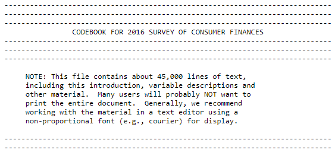

*This article was first published on [Medium](https://towardsdatascience.com/how-to-collect-data-for-your-analysis-a8bc58043e64).*

How great would it be when data could be as easily accessed as on Kaggle?

Data collection? Just visit Kaggle, find a suitable data set, and download it. How about analyzing the Titanic incident from 1912? Or how about image recognition of flowers? No? Maybe you want to predict credit card fraud detection? Guess what, Kaggle has you covered.

When you have decided on your data set of interest, the fun can finally start. Taking 5 minutes to find a suitable data set was already stressful enough, right? The most elaborate machine algorithms are waiting for you. So ultimately, who cares about the data?

Sadly, the real world is different. Having the right data and data quality are key to making causal statements or to constructing machine learning algorithms that can really have an impact. Without relevant data, your analyses would be fun, but irrelevant.

Obviously, you cannot always find perfectly preprocessed data that fulfill your needs. Also, you need to understand where the data has come from and how it was built. Ultimately, we need to keep in mind what Kaggle is.

>It is most famous for being a place in which one can enter competitions to solve data science challenges.

So if you want to make a name for yourself as a serious predictive modeler, you have found the perfect website to show off your skills. If you’re going to gather data to write a research paper or to build something that works in the real world, Kaggle could be the wrong source for your data.

In my experience, data collection and preparation can take days to complete. What I have done so far is to build data sets from scratch and access data sets from government institutions. Both have their limitations.

What I want to show you is a practical introduction to how you could create relevant data sets that support you in your research/machine learning goals.
Let’s get started.

First, you have to assess the following two questions to conduct your analysis.

* What kind of data do you need?
* How can you access it?

Answering these questions is critical but not always straightforward. Of course, a Google search could lead to results, but asking peers for advice could also be helpful. Spend some time with these questions until you’re sure that you have found the right answer.

## 1. Building a data set from scratch

In one of my projects, I needed to access financial data from German companies to analyze the effect of a new mandatory accounting standard on bid-ask spreads.

Luckily, my professor supplied us with a Thomson Reuters account, and I could use Datastream to access the financial data of these companies. You would think that simply using this database would be sufficient and that I could finally do the real work.

False! When gathering the data for these companies, I ended up with 8 different excel sheets that I had to somehow merge into one data frame.

Datastream provided me with some static company information that would end up as my main sheet.

<script src="https://gist.github.com/JRatschat/76a060e7e11a14059ea4b74ffe709c14.js"></script>

The other excel sheets that I got had the following format because I was accessing time-series data for each company.

<script src="https://gist.github.com/JRatschat/5192b85df1cd7723597f1a978abbf8bf.js"></script>

So how can I get such data into a meaningful format so that I can use it along with the other company information?

Let’s perform one of my calculations so that you get the idea. I had two sheets — one for bid prices and one for ask prices. What I needed was the average relative bid-ask spread.

First, I loaded the data and controlled for missing values. I spotted one row that was completely missing and deleted it for both data sets.

<script src="https://gist.github.com/JRatschat/2370fb9bb52695789bc00109990a5f2c.js"></script>

Then I calculated the bid-ask spread by subtracting the bid price from the ask price.

<script src="https://gist.github.com/JRatschat/c0fcd949a42ec26f878820dbfdc12dd2.js"></script>

```> str(bid_ask)
'data.frame': 152 obs. of  50 variables:
$ D.AB1 : num  0.034 0.069 0.038 ...
$ D.AOX : num  0.38 0.36 0.38 ...
$ D.AAD : num  0.38 0.4 0.36 ...
$ D.CAG : num  0.04 0.1 0.04 ...
$ D.B5A : num  0.36 0.395 0.395 ...
$ D.BDT : num  0.37 0.75 1 ...
$ D.BIO3: num  0.84 0.82 0.82 ...
$ D.O2C : num  0.151 0.15 0.15 ...
$ D.CEV : num  0.305 0.295 0.2 ...
$ D.CWC : num  0.535 1.175 1.335 ...
```

Then I had to calculate the relative bid-ask spread. Therefore, I had to import the daily stock prices, deleted the 149th row, and calculated the bid-ask spreads relative to the price.

<script src="https://gist.github.com/JRatschat/a315f1a9f4d23e484b8b22a3a63005a3.js"></script>

Finally, I calculated the mean of the relative bid-ask spreads and merged it into the static data frame.

<script src="https://gist.github.com/JRatschat/077571824c7fc5ccbeba86985aaab480.js"></script>

```> str(static)
'data.frame': 50 obs. of  6 variables:
$ MNEM                 : chr  "D.2HRA" "D.AAD" "D.AB1" ...
$ NAME                 : chr  "H & R" "AMADEUS FIRE" ...
$ WC05350              : POSIXct, format: "2011-12-31" ...
$ MV                   : num  644 150 331 638 622 ...
$ NOSHFF               : num  44 74 63 44 52 45 100 ...
$ mean_relative_bid_ask: num  0.0138 0.0139 0.0163 ...
```

This is only the code for one additional variable! Imagine doing that for 20 or even 30 other variables that you cannot get out-of-the-box from Datastream. This takes way longer than 5 minutes.

There are many other feasible methods of how you can create your own data set from scratch. You could, for example, conduct a good old survey or scrape tweets from Twitter. Ultimately, it depends on what kind of data you need.

Okay, it’s time for a quick assessment.

Advantages:

* Features are included based on the purpose of the research question or task. Not vice versa. This helps to only use meaningful data.
* It is traceable how the variables were created.

Disadvantages:

* It can be challenging to find suitable sources.
* It takes a lot of time to gather the data.
* Transforming features into the right format can be a lot of effort.
* Access to databases like Thomson Reuters is often restricted. If your university or employer does not have a license, this kind of information can get very costly.

## 2. Using a data set from a governmental institution

One could think that accessing data from governmental institutions is as easy as obtaining data from Kaggle. Wrong! Often, you have to put in a lot of time to understand the data.

So for another project, I wanted to research the effect of financial literacy on stock market participation. For assessing this research question, I found quite a lot of research papers that made use of the Survey of Consumer Finances to analyze stock market participation. Therefore, I accessed the newest version (2016) of this cross-sectional survey of US families.

>Little did I know how difficult understanding and working with this data set would be.

So the SEC has published all relevant data here. I spend a substantial time finding the right data set. First, I tried out the R-implementation, but in the end, I found it too difficult to use. Then, I accidentally downloaded the summary extract and wondered why the data was so different than described in the codebook. After a long journey of losing my mind, I found the complete data that I would be using for my analyses.

When looking at the data, I found that all variables were encoded. I had to use this codebook to make sense of the data. For every single variable…

<script src="https://gist.github.com/JRatschat/611f83af96c0a0cddfa3d30eb3176669.js"></script>

The codebook is really really long. Even the SEC notes on the first lines of the codebook the crazy size of this document. It contains about 45,000 lines of text. They recommend to not print the entire document. Great advice…

<figure>
  
  <figcaption>First lines of the SCF’s Codebook.
</figcaption>
</figure>

I spend many hours finding the questions that I could use to create meaningful variables. Ever used the search tool in Chrome? I probably used it 10,000 times for finding the right variables.

Luckily, the summary extract that I first downloaded proofed to be helpful. Instead of calculating the numerous financial information of the households in R, I just merged this data set to the complete survey data set. Funny story: The calculations are specified in a SAS script. I attempted to translate it into R. After wasting two hours, I remembered the summary extract…

Finally, I had a data set that I could start to analyze. But of course, I had many more problems with it. Have you ever heard of weighting and multiple imputations? These topics are difficult and painful, at least for me. But this is another story to tell.

Of course, the SCF is only one of the numerous available governmental data sets. And besides governmental data, there are also data sets from organizations like the [World Bank](https://data.worldbank.org/), [WHO](https://www.who.int/gho/database/en/), or [Unicef](https://www.iatiregistry.org/publisher/unicef). Some might be much easier to handle.

Again, a quick assessment.

Advantages:

* Commonly high data quality. Especially if the data has been used by other researchers or practitioners.
* Often data is well documented. Therefore, one can understand how the variables were created.

Disadvantages:

* It can take a lot of time to gather and transform features (think about the 45,000 lines of text).
* It can be hard to understand the data sets.
* Access is sometimes only given on a request basis.

## Conclusion

So what have we learned? Accessing data can be quite a hassle and takes time. Loading data and being ready to rumble? No, this is unrealistic.

But what collecting data the old way (not on Kaggle) ultimately does is that we must ask ourselves the right questions. We have to think before we have the data. Why? Because collecting data is a lot of effort. This means that we hopefully collect and use meaningful data for our analyses.

>Keep in mind that an analysis can only be as good as the quality of the data.

*If you have any questions or comments, feel free to reach me via the contact field or [LinkedIn](https://linkedin.com/in/jonathan-ratschat).*

