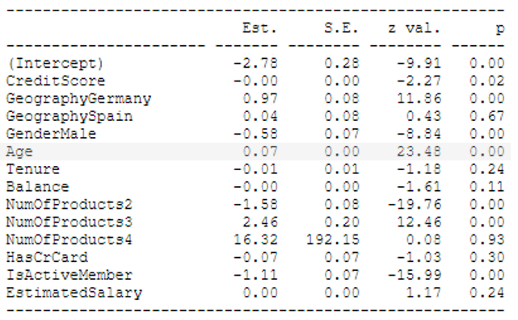

*This article was first published on [Medium](https://towardsdatascience.com/how-to-increase-the-interpretability-of-your-predictive-model-b786d72365f1).*

Accuracy and interpretability are said to be diametrically different. Complex models tend to achieve the highest accuracies, while simpler models tend to be more interpretable.

But what if we want to get the best of both worlds? Getting a high accuracy is cool, but wouldn’t it be great if we can understand the model? Especially, if the prediction is essential to the success of a business? As Ribeiro et al. state:

>“[…] if the users do not trust a model or a prediction, they will not use it.” (Ribeiro et al. 2016, p. 1)

## Hypothetical Situation

Let’s imagine the following: We work as data scientists at a huge savings bank. Our job is to make sure that we know which customers have a high likelihood to churn.

What will happen with our model? We will use our results to create customer groups with differing churn probabilities.
The customer groups with the highest churn probabilities then receive targeted marketing so that they hopefully do not leave the bank.

Retaining customers is associated with much lower costs compared to acquiring new customers (Keaveney 1995). Therefore, our job is crucial for the success of the bank!

**We must achieve two goals:**

* The marketing team must receive the most accurate results possible. Why? Because the bank is spending money to retain these customers. If the customers would have stayed anyway, the bank is throwing money out of the window.

* We must convince relevant stakeholders that they can trust our results. Good luck explaining to the marketing boss how we created our model…

So let’s imagine that the marketing boss does not understand our model, but trusts us (for whatever reason). *Therefore, they implement our complex model.*

* This model has high predictive power. The marketing team is happy because they are seeing that the measures conducted help to retain customers. We are so glad because we get positive feedback for the model.

Nice! We could call it a day and focus our efforts on the next task to even receive more credits for the great work that we do.

**BUT STOP! HOLD ON!**

Accuracy and interpretability cannot be achieved with the same model, right?

Therefore, we focused only on the model’s accuracy. But what if the model has flaws?

We could have included one variable in our model that has literally no meaning. Somehow, it worked for a while, but then it didn’t, and nobody recognized it.

Even worse: We could have created a sexist algorithm that causes an uproar on social media. Do you think I’m kidding? This has somehow happened to [Apple and Goldman Sachs](https://www.nytimes.com/2019/11/15/us/apple-card-goldman-sachs.html).

> Would a manager risk his/her career for only a few accuracy points more?

I can give you a plain and simple answer here… No, managers won’t take the risk. They have spent many years building their careers, and they don’t know anything about machine learning.

Of course, predicting churn probabilities is probably not a hot-topic that will lead to an uproar in the media. But if our model is not working in our favor because we failed to understand it correctly, the consequences can be painful.

## The Solution

Interpretability is essential because it promotes confidence and trust in our model. Users do not adopt a model that fails to do so. Also, enhanced interpretability can help to improve model performance and extends the knowledge that we can derive from the model (Lundberg & Lee 2017).

Nice! By increasing interpretability, we are not only able to understand our model, but we could gain valuable insights. Maybe the marketing team would love to get more ideas about their customers?

Luckily, eliminating the trade-off between a model’s accuracy and a model’s interpretability has gained attention by researchers (Ribeiro et al. 2016, Lundberg & Lee 2017, Chen et al. 2018).

> One of their solutions has gained a lot of attention: SHapley Additive exPlanations (SHAP) values introduced by Lundberg & Lee (2017).

SHAP values stem from game theory. They measure the marginal effect that the observed level of a variable has on the final predicted probability for an individual (Lundberg et al. 2019).

Through this approach, it becomes feasible to explain why a customer receives its churn prediction value and how the features contribute to this prediction. This local interpretability increases transparency. Also, it becomes feasible to combine local explanations to derive global interpretability.

Let’s use these mysterious SHAP values to transform a complex model into a complex AND interpretable model.

## And Action

Remember, we want to know which customers will churn. Therefore, I use this [Kaggle data set](https://www.kaggle.com/barelydedicated/bank-customer-churn-modeling) for predicting churn probabilities of bank customers.

For the prediction, I used a basic logistic regression and a default XGBoost algorithm. To make the post somehow readable, I won’t show lines of code. If you’re interested in knowing how I build the model, please have a look at [my GitHub repository](https://github.com/JRatschat/How-to-Increase-the-Interpretability-of-Your-Predictive-Model). There you can find everything that you need.

So let’s quickly compare model statistics of the logit model and the default XGBoost model.

The logit model reaches a test accuracy of 84.1 percent while the default XGBoost model has a test accuracy of 86.6 percent. How about AUC? Here, the logit model has an AUC of 82.3 percent compared to an AUC of 85.1 percent for the default XGBoost model.
Indeed, the more complex model is better in predicting who’s going to churn and who’s going to stay at the bank.

So what we could generally use for XGBoost are three different importance measures through which we can have a more detailed look on our model.

<figure>
  
  <figcaption>Importance plots of XGBoost model. Plot created by author.
</figcaption>
</figure>

What comes to my mind? The three importance measures assign different levels of importance to the features.

Also, I cannot see the relationship between the independent variables and churn. Does a higher age increase or decrease the probability of being a churner? The plots do not help answer this question.

So let’s have a look at how our model is interpreted using SHAP values.

In the figure below, features are ordered by their global impact on the default XGBoost model. Higher SHAP values represent a higher prediction of a customer exiting the bank. The dots represent the feature impact on the model output of individual predictions of the training set. Depending on the feature value, the dots are colored from blue (low) to red (high). Therefore, we can explore the extent, strength, and direction of a feature’s effect.

<figure>
  
  <figcaption>SHAP summary plot. Plot created by author with [SHAPforxgboost](https://github.com/liuyanguu/SHAPforxgboost).
</figcaption>
</figure>

The highest global feature importances are taken by Age, NumOfProducts, and IsActiveMember. There are several interesting insights that we can derive from this summary plot:

* The range of feature impacts on the forecast is widely distributed. For example, age has a strong effect on the prediction for some customers, while for others, it only has a small effect.

* Although some of the variables have low global importance, the feature’s influence can be powerful for some individuals. For example, the credit score has a positive predictive relationship with churn for people with low credit scores.

* At first sight, some variables show an intuitive relation to churn, while for others, it is counterintuitive. For example, why is a higher number of products related to an increase in the churn probability? Does this make sense?

To explore single variables more closely, we can use dependence plots. In the figure below, a SHAP dependence plot for age is displayed. As with the summary plot, each dot is a customer. As shown, younger customers have a lowered predictive value to churn, while older customers have an increased predictive value to churn. But this is not a linear relationship! When reaching the age of 60, customer churn probabilities start to decrease.

<figure>
  
  <figcaption>SHAP dependence plot. Plot created by author with [SHAPforxgboost](https://github.com/liuyanguu/SHAPforxgboost).
</figcaption>
</figure>

Good luck exploring this relationship with a logit model…

<figure>
  
  <figcaption>Summary output of logistic regression based on the same data as the XGBoost model. Age variable is highlighted.
</figcaption>
</figure>

To get crazy, we can also look at the interaction effects of variables.

On the left panel below, you can see the same dependence plot for the age variable. But this time, I added the gender variable to see how age and gender interact with each other.

On the right panel, the interaction effect of age and gender is depicted more closely. Somehow (and I am lacking the domain knowledge to interpret this), there is a different behavior of men and women when paired with age. For example, younger women have negative SHAP interaction value meaning that the SHAP value is lower for young women compared to young men.

<figure>
  
  <figcaption>SHAP dependence plot (left panel) and SHAP interaction plot (right panel) for age and gender. Plots created by author with [SHAPforxgboost](https://github.com/liuyanguu/SHAPforxgboost).
</figcaption>
</figure>

So far, so good. But how about the mentioned effect of the number of products that the customers have on the churn prediction? At least for me, it seems counterintuitive that customers with more products have a higher likelihood of churning. We all know how hard it is to terminate contracts, especially bank contracts.

When looking at the coefficient values of the logistic regression, we see the same effect. Somehow, customers that have two products have a lower churn probability compared to customers that have one, three, or four products.

<figure>
  
  <figcaption>Summary output of logit model based on the same data as the XGBoost model. NumOfProducts2 variable is highlighted.
</figcaption>
</figure>

Therefore, I assume that this trend is present in the data and not randomly used by our XGBoost model.

Am I still worried? Yes. What would I usually do?

* **Look at the literature.** This relationship could make sense, who knows?

* **Question the relevance of the data.** I already had the topic in mind when I was searching for a data set. I did not have a lot of alternatives, and this data set has no copyrights. The algorithm is only as good as the data.

* **Explore the data set.** An explanatory analysis before building the model is highly advisable. Maybe, I could find some patterns that can explain this counterintuitive result.

* **Delete the variable.** If I suspected that the variable does not provide meaningful results and could lead to flaws, I would delete it. Even if that would mean losing some accuracy or AUC percentage points.

The analysis that I have conducted so far could be done for every variable. We need to fully understand our model, right? But since this article has gotten really long (thumps up if you made it so far!), I will spare you further analysis.

## Conclusion

It is vital that we understand our predictive model and that this model captures the generalized underlying trends of the data. If not, the company faces a ticking time bomb. All could go well until it doesn’t anymore.

Also, we need to able to explain our results to relevant stakeholders. Explaining predictive models and first foremost SHAP values to someone who has trouble understanding basic statistics is hard! Still, these stakeholders are often the decision-makers, so we must make sure that we can convince them that our model really works in practice.

Besides mitigating possible risks by increasing the trust in our model, we can get additional insights that we wouldn’t get with simpler models. This can be highly relevant. Especially for marketing departments who are always interested in understanding their customers.

*If you have any questions or comments, feel free to reach me via the contact field or [LinkedIn](https://linkedin.com/in/jonathan-ratschat).*

*Stay tuned, and see you in the next post!*

## References

[1] Ribeiro, M. T., Singh, S. & Guestrin, C. (2016), “Why should I trust you?”: Explaining the predictions of any classifier, in B. Krishnapuram & M. Shah, eds, ‘KDD ’16: Proceedings of the 22nd ACM SIGKDD International Conference on Knowledge Discovery and Data Mining’, pp. 1135–1144.

[2] Keaveney, S. M. (1995), ‘Customer switching behavior in service industries: An exploratory study’, Journal of Marketing 59, 71–82.

[3] Lundberg, S. & Lee, S.-I. (2017), A unified approach to interpreting model predictions, in U. von Luxburg, I. M. Guyon, S. Bengio, H. M. Wallach & R. Fergus, eds, ‘NIPS’17: Proceedings of the 31st International Conference on Neural Information Processing Systems’, pp. 4768–4777.

[4] Chen, J., Le Song, Wainwright, M. J. & Jordan, M. I. (2018), Learning to explain: An information-theoretic perspective on model interpretation, in J. G. Dy & A. Krause, eds, ‘Proceedings of the 35th International Conference on Machine Learning’, pp. 882–891.

[5] Lundberg, S. M., Erion, G. G. & Lee, S.-I. (2019), ‘Consistent individualized feature attribution for tree ensembles’, pp. 1–9.

