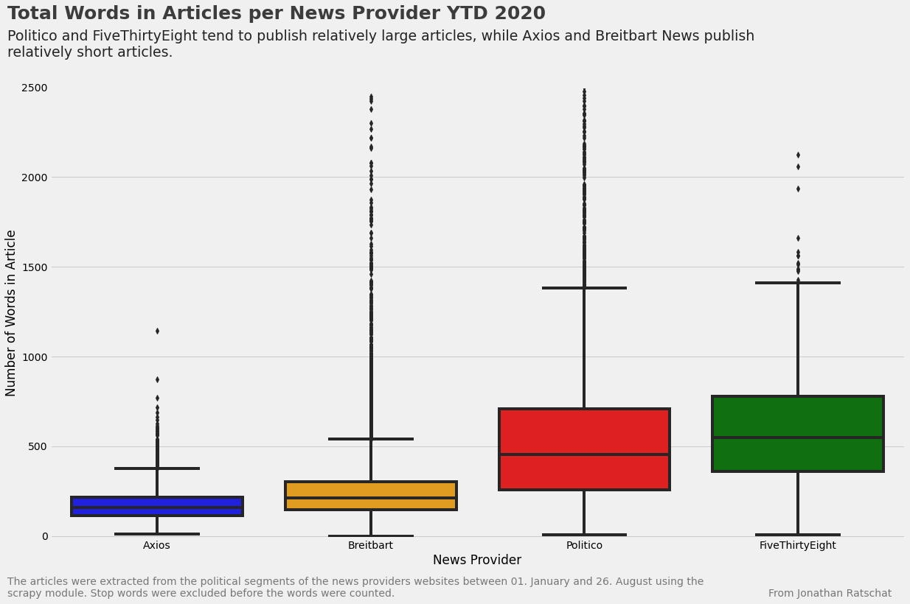
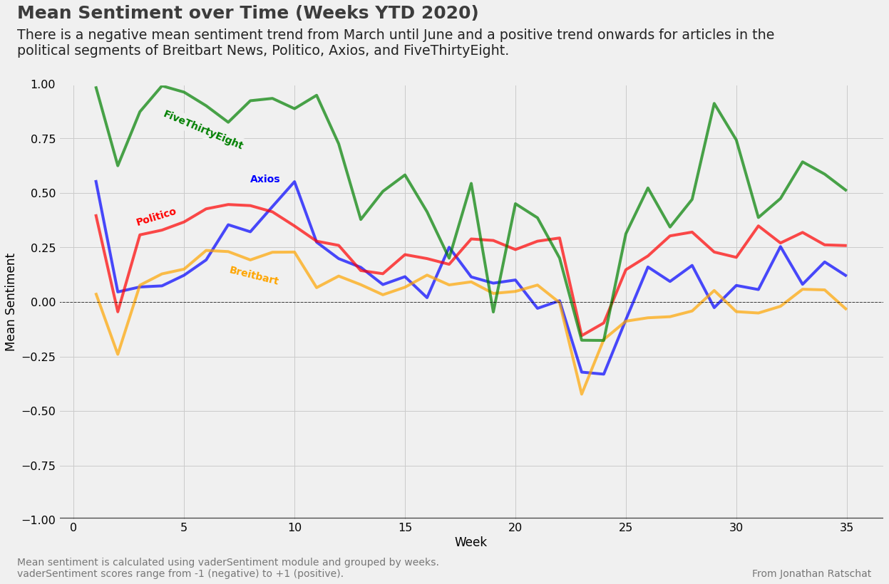
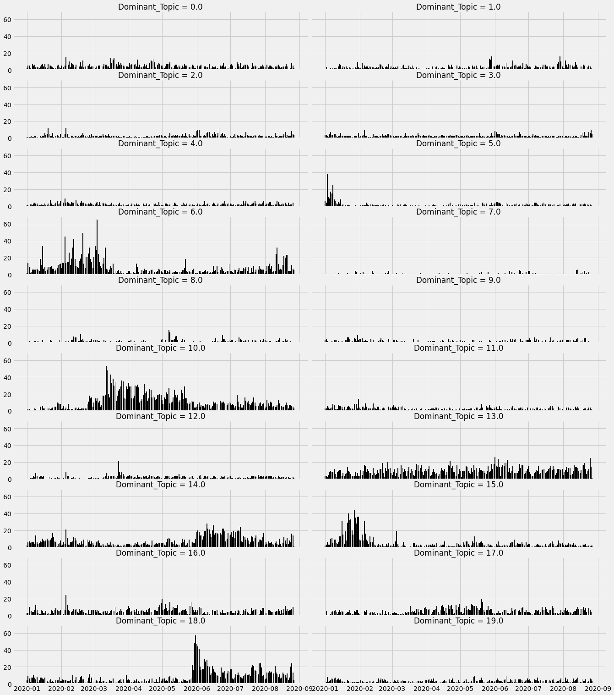
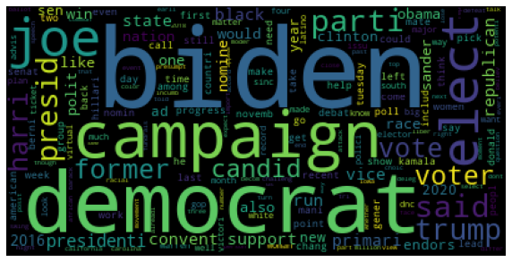
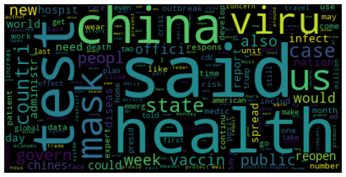
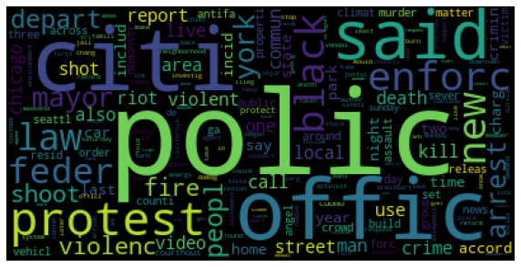
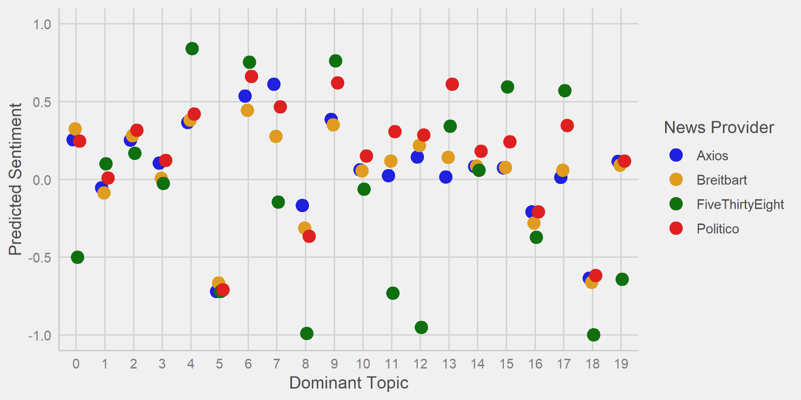

*This article was first published on [Medium](https://medium.com/towards-artificial-intelligence/ideology-classification-of-u-s-news-through-sentiment-37d911f31f8c).*

I wanted to determine if news providers’ ideology can be objectively classified by performing some common natural language processing tasks on news articles.

But let’s start from the beginning…

Political division is a vital problem in the U.S. Nowadays, even what we eat, what we drive, and how we live is associated with either being Democrat or Republican. Decisions like [wearing or not wearing a mask](https://www.bbc.com/news/world-us-canada-53477121) become part of political identity.

This political division’s foundation was laid when people with college degrees moved to the cities, and less-educated people stayed in rural areas in the 1970s. Jobs, technologies, and industries followed accordingly, and the cultural differences between Democrats and Republicans were amplified with the emergence of partisan media and social media networks [1].

If you think about it: People are exposed to different kinds of information. What people read and what people hear plays a vital role in how they see the world.

So if people are exposed to a news provider that is considered as “far-right” and “ideologically driven,” for example, Breitbart News [2], the world view of this news provider could have a notable influence on their reader’s world view.

Would I recognize the political ideology of a news provider by just reading some of their articles? And how about other people? Imagine reading “far-right” articles and thinking that this is considered “normal”…

>This is why I started to think about how I can objectively classify news providers’ ideology.

Ultimately, I had the idea that Breitbart News would use, for example, more negative words when reporting about Joe Biden while using more positive comments for Trump than other news outlets.

Hence, articles written about a topic that agrees with a particular ideology would have a positive sentiment, while disagreeing issues would negatively affect sentiment.

Using data from four news providers and applying sentiment and topic models, I will test if my hypotheses are true. If you’re interested in knowing how I conducted the analysis using Python and R, please look at my [GitHub repository](https://github.com/JRatschat/US_News). There you can find everything that you need.

## Data

I focused on articles from Breitbart News, Politico, Axios, and FiveThirtyEight for the analysis. Let’s first understand who these news providers are and what they stand for.

I have already introduced Breitbart News, but I will use their wording this time. They stand for “truthful reporting and the free and open exchange of ideas” because this is “essential to maintaining a robust democracy.” Also, they believe “in the greatness of America.”

Axios is a news provider that oughts to “deliver the clearest, smartest, most efficient, and trustworthy experience for audience and advertisers alike.” They claim not to follow any ideology. Also, their style of writing was described as a mix of Twitter and the Economist.

Politico’s main topics are politics and policy, and their goal is to become the dominant news source on these topics. The stand for “access to reliable information, nonpartisan journalism, and real-time tools” to “create, inform and engage a global citizenry.”

Last, FiveThirtyEight follows a data-driven coverage of politics and sports and uses common data visualization and statistical analyses to provide a unique news experience.

I have to admit: This is a wild mix. Not the typical news providers that you would find in a research paper. So why have I chosen these news providers?

* First, I needed some news sources that have a different ideology than Breitbart News. Axios explicitly states that it does not follow any ideology. Therefore, it should be neutral when it comes to ideology. The same goes for Politico that stands for nonpartisan news coverage. For FiveThirtyEight, it’s not as clear. I assumed a more left-leaning position due to their reports in the 2016 election that argued that “Donald Trump isn’t a real candidate” and gave him minimal chances of winning the election.

* Second, I would have loved to gather articles from more well-known left-leaning news providers like the New York Times or Washington Post. Sadly, the providers that I had a look at often had websites based on Javascript (instead of HTML), making it harder to extract information with the approach that I used. Also, many news providers have a paywall making it impossible to extract articles without paying for it.

After I had decided which news providers I wanted to analyze, I gathered articles on the political segments of these news providers. Also, I only extracted pieces from 2020 to have a somehow limited amount of topics.

These decisions led to a data set that consists of approximately 32.5k articles. Breitbart News contributes around 20k articles to the data set, while I only extracted around 500 items from FiveThirtyEight. Also, there are roughly 7.8k articles from Politico and 3.7k from Axios. Therefore, the findings for Axios, Breitbart News, and Politico should be more robust than the results for FiveThirtyEight.

I found it interesting to explore some of the differences between the news providers. You can see in the plot below that Axios publishes the shortest articles (it’s no surprise that they are compared to Twitter), closely followed by Breitbart News. Politico and FiveThirtyEight tend to have longer articles.

<figure>
  
  <figcaption>
</figcaption>
</figure>

## Sentiment

Now that I had extracted the data that I needed, it was time to calculate every article’s sentiment. I decided to use the well-established VADER model [3], which is predominantly used for social media postings. However, it was also tested with New York Times Editorials and achieved the best F1 score compared to other sentiment analysis lexicons. Hence, it can also be applied to other areas.

The model uses a generalizable sentiment lexicon. The list was inspired by the renowned word-banks LIWC, ANEW, and G.I., but the researchers also included emoticons and slang into the dictionary. Interestingly, it not only relies on a fixed sentiment score for each word but also incorporates grammatical and syntactic cues. To take some examples from their paper:

* Booster words: “The service here is extremely good” has a stronger positive sentiment than “The service is good.”

* Contrastive conjunction: “The food here is great, but the service is horrible.” VADER would sense a mixed sentiment with the latter part of the sentence being dominant.

* Shifts in polarity: “The food here isn’t really all that great.” Although this sentence includes the positive word great, VADER can classify the negative sentiment.

Although VADER was not built with newspaper articles in mind, I finally decided that its theoretical foundation would be a “good-enough” fit for my analysis.

Additionally, VADER becomes handy when working with more massive data sets because it is computationally cheap and does not require training data. Although other algorithms like Google’s BERT could have led to more accurate results, I still remembered the endless computing times that I had with another project, and I was not willing to go through this again.

When plotting the mean sentiment of the articles by week, two striking insights became apparent to me:

* There are differences in the sentiment scores between the news providers. FiveThirtyEight tends to have the most positive articles on average, while Breitbart News has the most negative articles on average compared to the other news providers.

* The news provider’s sentiment develops alike when looking at it over time. For example, all news providers see a strong negative drop of the sentiment score in week 23 and 24 with a recovery in the following weeks. This finding indicates that some topics or occurrences are classified as more positive or negative by VADER than other issues. For example, a major adverse event could have happened in week 23 because there is such a drop in sentiment scores.

<figure>
  
  <figcaption>
</figcaption>
</figure>

## Topics

Since different events are very likely to affect the news articles’ sentiment, it becomes crucial to classify the items into various topics. If not, the sentiment scores would be influenced by the topics, and ideology classification would not be feasible.

Latent Dirichlet Allocation (LDA) is an unsupervised machine learning model that extracts the main topics of a given set of words. It assumes that every document consists of a mix of different topics. By going through the documents, LDA extrapolates which topics could have generated them.

I used LDA to generate topics and to calculate the topic probabilities for each article. For the analysis, I only stored the subject with the highest topic probability. Ultimately, I ended up with 20 overarching topics for January to August 2020. Instead of looking at every topic in detail (which would be boring for you), let’s look at the most prominent issues.

You can see the number of articles per day in the below plot, depending on the topic. Some of the issues seem of relatively low importance, while other topics show a high presence.

<figure>
  
  <figcaption>
</figcaption>
</figure>

From first sight, Topic 6, 10, and 18 do look the most interesting. I created word clouds and looked at articles with the highest topic probabilities to better understand these topics.

By looking at the word cloud for Topic 6 and the articles with the highest topic contributions, it is relatively sure that these articles are about the Democratic presidential candidates.

<figure>
  
  <figcaption> Topic 6
</figcaption>
</figure>

    Topic Contribution: 100%
    "Why Bernie Sanders Lost" (FiveThirtyEight)

    Topic Contribution: 99%
    "Electile Dysfunction: Joe Biden Pulls Out Early from New Hampshire" (Breitbart News)

    Topic Contribution: 99%
    "Joe Biden says Iowa caucus results were a "gut punch"" (Axios)  
    
This overarching topic also makes sense when having a look at article count over time. Until March, this topic was of high interest to news providers and the public. Then the interest decreased after Buttigieg, Bloomberg, and Warren dropped out of the Democratic race. Interest increased shortly when Sanders suspended his campaign on April 8 and stayed low until Biden officially won the nomination on August 18.

So how about Topic 10?

<figure>
  
  <figcaption> Topic 10
</figcaption>
</figure>

You guessed right: Topic 10 mostly consists of articles related to the coronavirus. The word cloud and the article count per day makes sense. I additionally checked the articles with the highest topic contributions:

    Topic Contribution: 99%
    "China Has Not Accepted U.S. Offers to Send CDC Experts to Aid in Coronavirus Fight" (Breitbart News)
    
    Topic Contribution: 99%
    "How many Americans have been tested for coronavirus?" (Politico)
    
    Topic Contribution: 99%
    "Azar: Coronavirus 'a fast-moving, constantly changing situation" (Politico)

Topic 18 seemed relatively easy to spot when only looking at the word cloud and the time trend. For me, it was screaming “Black Lives Matter”!

<figure>
  
  <figcaption> Topic 18
</figcaption>
</figure>

But when I was assessing the articles with the highest topic contributions, I was confused first. Generally, LDA gave news articles with police operations the highest topic contributions.

    Topic Contribution: 99%
    "Armed Homeowner Kills One Alleged Intruder, Wounds Second" (Breitbart News)
    
    Topic Contribution: 97%
    "Pennsylvania Homeowner Shoots Alleged Intruder Dead" (Breitbart News)
    
    Topic Contribution: 96%
    "Watch: Daytona Beach Police Shoot Alleged Armed Carjacker" (Breitbart News)
    
But this would have not explained why there was this upheaval in articles during the riots. When looking at articles with lower topic contribution scores, the articles that I had expected appeared.

    Topic Contribution: 90%
    "Philadelphia Cops Injured with Chemical Burns During Violent Protests" (Breitbart News)
    
    Topic Contribution: 90%
    Title: "Protesters Set NYPD Cars Ablaze in Union Square" (Breitbart News)
    
    Topic Contribution: 88%
    Title: "Police Cars in LA, Chicago Damaged and Destroyed by Protesters" (Breitbart News)
    
This topic intrigued me. Most articles of Breitbart concerning this topic were in favor of the police. When I was looking at reports from Axios, this view diametrically changed to more centered items on what had happened to protesters. This is a significant difference in ideology, but it’s questionable if this difference can be tracked by news sentiment because both points of view should be rather harmful.

## Multiple Linear Regression

After I generated variables for both sentiment and topic analyses, I was finally able to conduct a regression estimation. First, I ran a multiple linear regression to see how the topics and news providers (independent variables) are related to the news article’s sentiment (dependent variable). I used robust standard errors since the errors are heteroskedastic.

Sentimentᵢ = β₀ + β₁⨯Dominant_Topicᵢ + β₂⨯NewsProviderᵢ + 𝜀ᵢ

Axios together with Topic 0 is the base case and hidden in the intercept’s coefficient.
Topic 5 (e.g., *attack, terrorist, hong kong, iran*) and 18 (e.g., *police, riots, black*) is associated with more negative sentiment while topic 6 (e.g., *biden, democrat, campaign*) is associated with a more positive effect on sentiment. Also, Politico and FiveThirtyEight tend to report more positively than Axios (as indicated in the intercept) and Breitbart News.

But we have to be careful here because the p-value of Breitbart News is nowhere near the commonly used significance levels. Therefore, we can’t reject the Null hypothesis that there is no difference in conditional means between Breitbart News and its articles’ sentiment.

Although this regression enables some first insights, it is not enough to understand the underlying ideology of a news provider. Remember: I hypothesized that news providers would have differing sentiments about different topics.

## Multiple Linear Regression with Interaction Effects

Therefore, I decided to conduct a multiple linear regression with interaction effects. By using interaction effects, it is now feasible to analyze the combined effects of the dominant topics and news providers. Also, I still used robust standard errors in the estimation.

[Sentimentᵢ = β₀ + β₁⨯Dominant_Topicᵢ + β₂⨯NewsProviderᵢ + β₃⨯(Dominant_Topicᵢ⨯NewsProviderᵢ) + 𝜀 ](https://gist.github.com/JRatschat/7c3548b8d130e3d399d7fa51edcc479c)

Some of the p-values of the topics and also Breitbart News and Politico are not near the commonly used significance levels.

Still, in the plot below you can see the predicted sentiment per topic and news provider. When searching for differences in sentiment and checking the p-values for each interaction effect in the [regression table](https://gist.github.com/JRatschat/7c3548b8d130e3d399d7fa51edcc479c), only Topic 6 seems interesting. Remember: this topic is predominantly about the Democratic presidential candidates.

<figure>
  
  <figcaption>
</figcaption>
</figure>

    **Predicted Sentiment per News Provider for Topic 6**
    Axios: 0.54
    Breitbart News: 0.44
    FiveThirtyEight: 0.75
    Politico: 0.66

Breitbart did indeed have the articles with the lowest sentiment. When taking a close look at the interaction terms for Topic 6, it becomes apparent that the coefficient of Breitbart News is the only one with a negative association.
Still, I have to admit that I was somehow disappointed. Only one out of 20 topics showed a result that somehow followed my hypothesis. Also, the differences between the predicted sentiment scores seemed not as high as I would have expected.

## Assessment

So what did I do? And how did it go? What did I learn?

First, I gathered data from four different news providers. Pretty amazing what one can do with a web crawler like scrapy. I was incredibly happy that I was able to gather the articles from the news provider’s websites. A downer was, however, that I could not scrape articles from the New York Times or the Washington Post. These news providers would have better reflected the Democratic element for my analysis.

Second, calculating the sentiment with the VADER module and looking at it over time led to interesting insights. I was able to spot that the news provider’s sentiment develops alike over time. This finding led me to the hypothesis that topics or occurrences are inherently either positive or negative. Big up- or downswings can happen when major events occur.

Third, classifying news articles into topics using LDA went smoothly. I was impressed by how topics like the “Democratic presidential nomination” or the “Coronavirus” were accurately classified and how much sense the article count over time made.

Exploring the topics led to realizing the first notable difference between Breitbart News and the other news providers: One can influence an event’s perspective. Breitbart News focused predominantly on what did happen to police officers during protests and riots while the others focused more on the protesters. This difference alone is a strong indicator of a news provider’s ideology.

Third, conducting the regression estimations presented answers to some of the hypotheses that I had made. Yes, sentiment scores are very different, depending on the topic. Also, the estimation did shed light on the general tendency of a news provider’s sentiment. But this alone was of no help in classifying a news provider’s ideology. Only the interaction effects of Topic 6 were promising, but sadly this topic was the only one where my hypothesis somehow made sense.

## Conclusion

Ultimately, I think that my approach to classifying ideology by comparing sentiment scores failed. I still like the idea, but it seems that topics that are perceived as positive or negative depending on the political view are relatively rare.

But I found one very interesting insight during the topic analysis: News providers reported quite differently about the Black Lives Matters protests. Sadly (for my analysis), the sentiment was not affected by this difference.

Still, I have done some groundwork for further investigations. If I have some more time and you are interested in it, I could imagine myself going back to the Black Lives Matter topic. Finding some methods that can objectively show the differences that I indicated would be awesome.

*If you have any questions or comments, feel free to reach me via the contact field or [LinkedIn](https://linkedin.com/in/jonathan-ratschat).*

*Stay tuned, and see you in the next post!*

## References

[1] https://edition.cnn.com/interactive/2019/11/opinions/fractured-states-of-america/part-one-fredrick/

[2] https://en.wikipedia.org/wiki/Breitbart_News

[3] Hutto, C.J. & Gilbert, E.E. (2014). VADER: A Parsimonious Rule-based Model for Sentiment Analysis of Social Media Text. Eighth International Conference on Weblogs and Social Media (ICWSM-14). Ann Arbor, MI, June 2014.

